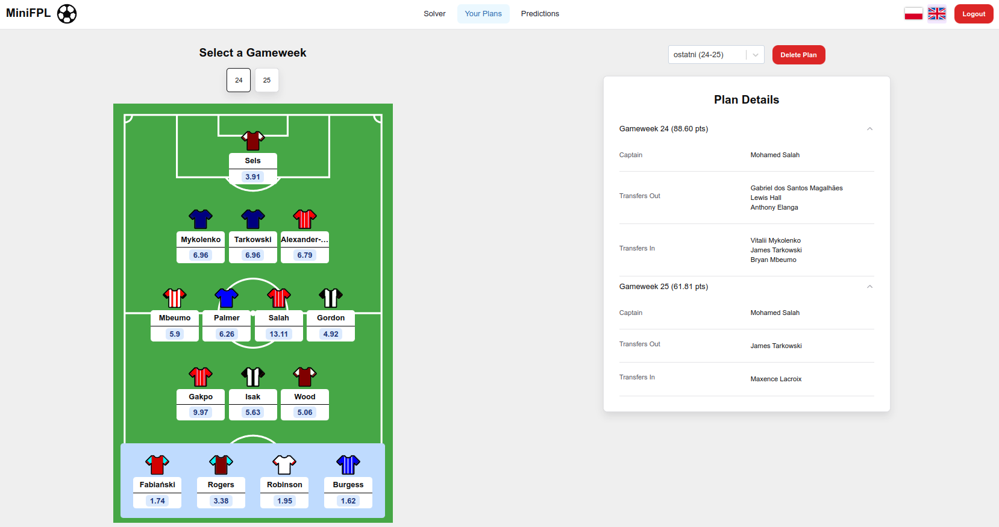

# **MiniFPL Frontend**

A Fantasy Premier League web app built with **React** using a structure inspired by [**Bulletproof React**](https://github.com/alan2207/bulletproof-react/tree/master) and styled with **[Chakra UI v3](https://www.chakra-ui.com/)**.

### **Features**
- View **point predictions** from my FPL prediction module:  [tuzuModel](https://github.com/FantaInz/tuzuModel)
- **Create and manage plans** for future gameweeks
- Available in **Polish and English**

---

## **Screenshots**

### **Solver Page**
View your squad from the last gameweek and start the solver.  


### **Plans Page**
Manage plans created by the solver for **both future and past gameweeks**.  


### **Predictions Page**
Filter, sort, and analyze **player predictions**.  


---

## **Run it Yourself**

### **1. Run the Backend**
Make sure the backend is running:  
[Backend Repository](https://github.com/FantaInz/BackEnd)

### **2. Clone the Repository**
```bash
git clone https://github.com/FantaInz/minifpl-front.git
cd minifpl-front
```

### **3️. Install Dependencies**
```bash
npm install
```

### **4. Start the Development Server**
```bash
npm run dev
```
Then visit:  
[**http://localhost:3000/**](http://localhost:3000/)

---

## **Run with Docker**
You can also run the app inside a **Docker container** using the provided `Dockerfile`.

## **Contact**
If you have any questions, feel free to reach out!
**Email:** [szymone25@gmail.com](mailto:szymone25@gmail.com)  
